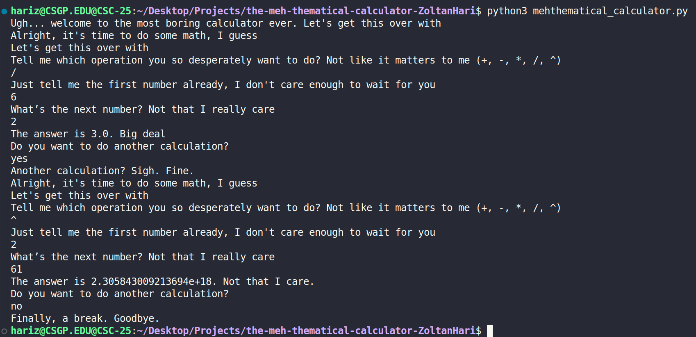

[](https://classroom.github.com/a/GDLJrpJJ)
# Mehthematical Calculator

The Mehthematical Calculator is a calculator that allows you to add, subtract, multiply, divide, or use exponents on 2 numbers while the calculator in very unenthusiastic about doing it's job and want to be done and leave as quickly as possible. 

## Requirements

Python 3

## Installation

1. Clone the Repository 
```bash
git clone https://github.com/WTCSC/the-meh-thematical-calculator-ZoltanHari.git
```
2. Open the Cloned Repository 
```bash
cd the-meh-thematical-calculator-ZoltanHari
```
## Usage

1. Type the Operation You Want to Use

2. Then Type the First Number 

3. Finally, Type the Second Number (This Will be the Exponent the First Number is Going to the Power of)

## Usage Example



## Path Modification

To edit or add new dialogue or operations, open the **`mehthematic_calculator.py`** file in a text editor like VS Code and use the following format
```python
def operation():
    result = (num_1 (operation) num_2)
    type_out(f"The answer is like {result}, I guess. Try not to get too excited.")

while True:
    operation = get_operation("Tell me which operation you so desperately want to do? Not like it matters to me (+, -, *, /, ^, (new operation))")

    match operation:
        case "operation":
            operation()
```
## Path Modification Example

```python
def square_root():
    result = (num_1 + num_2 ** 0.5)
    type_out(f"The answer is like {result}, I guess. Try not to get too excited.")

While True:
    operation = get_operation("Tell me which operation you so desperately want to do? Not like it matters to me (+, -, *, /, ^, ^0.5(Square Root))")

    match operation:
        case "^0.5":
            square_root()
```
## Decision Tree

https://docs.google.com/document/d/1uJ2AdxNT7z2FIfS5rxXMgYbf-H68o3JvOQp-OGj3IEw/edit?tab=t.0

